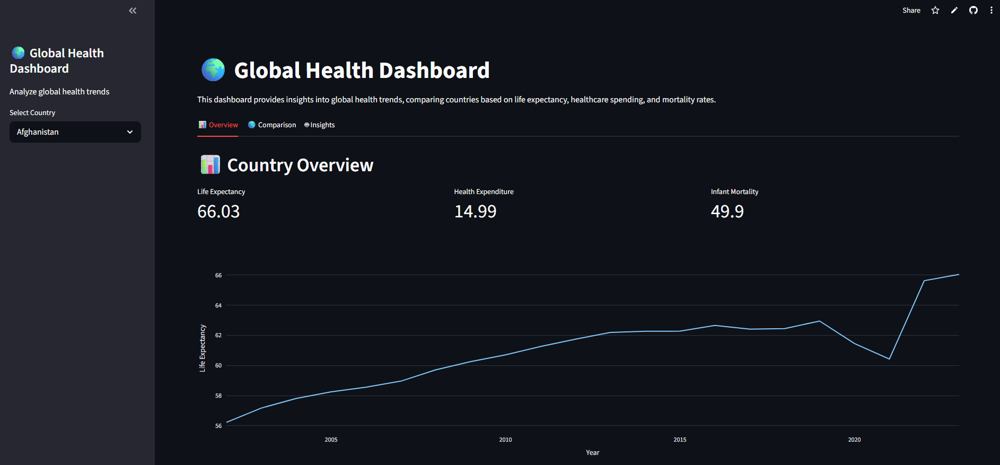
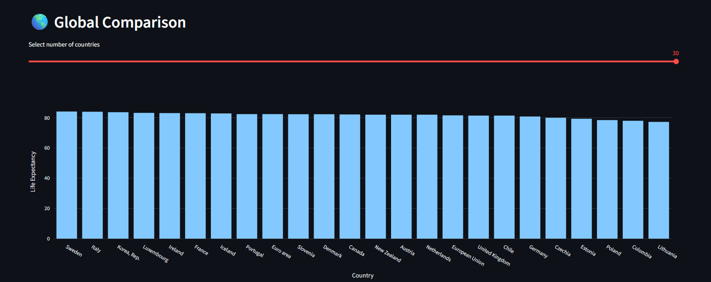
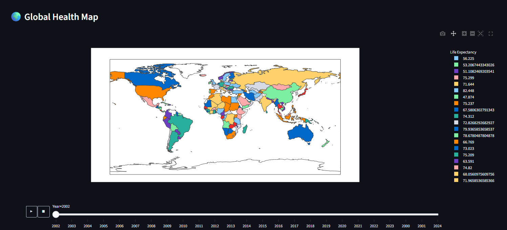
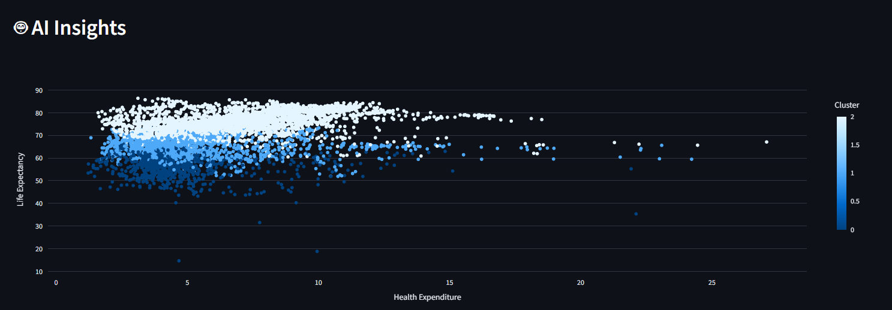

# 🌍 Global Health Analytics Dashboard

🔗 **Live App:** https://global-health-analytics-dashboard.streamlit.app/

---

## 📌 Overview

This project is an interactive data analytics dashboard built using Python and Streamlit to analyze global health trends using real-world data from the World Bank.

It allows users to explore country-level health indicators, compare global trends, visualize data on an interactive map, and gain insights using machine learning.

---

## 📸 Dashboard Preview

### 📊 Overview



### 🌎 Comparison



### 🌍 Global Map



### 🤖 AI Insights



---

## 🚀 Features

* 📊 Interactive KPI cards (Life Expectancy, Health Expenditure, Infant Mortality)
* 📈 Time-series trend analysis for selected countries
* 🌎 Global comparison of countries (Top-N selection)
* 🌍 Animated choropleth world map (year-wise visualization)
* 🤖 Machine learning clustering (K-Means) to group countries
* ⚡ Optimized performance using caching

---

## 🛠 Tech Stack

* **Python**
* **Pandas, NumPy** (data processing)
* **Plotly** (interactive visualizations)
* **Streamlit** (dashboard framework)
* **Scikit-learn** (machine learning)

---

## 📊 Data Source

* World Bank Global Health Indicators Dataset

---

## ⚙️ How It Works

1. Raw World Bank data is loaded and cleaned
2. Data is reshaped from wide format to long format
3. Relevant health indicators are selected
4. Data is transformed into structured format
5. Dashboard visualizations are generated
6. Machine learning clustering is applied

---

## 📂 Project Structure

```
global-health-dashboard/
├── app.py
├── analysis.py
├── model.py
├── requirements.txt
├── README.md
└── assets/
```

---

## 💼 Project Highlights

* Built a complete data pipeline (cleaning → transformation → visualization)
* Worked with real-world structured dataset (World Bank)
* Integrated machine learning for data insights
* Designed interactive and user-friendly dashboard UI
* Deployed live application using Streamlit Cloud

---

## 📜 License

This project is licensed under the MIT License.

